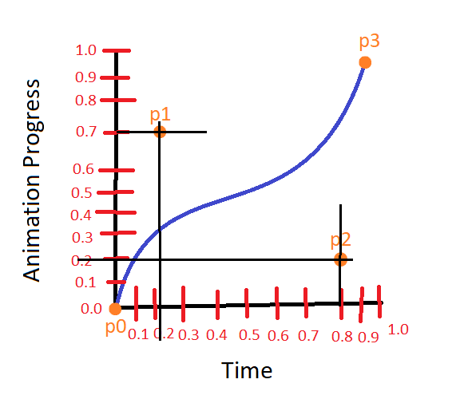
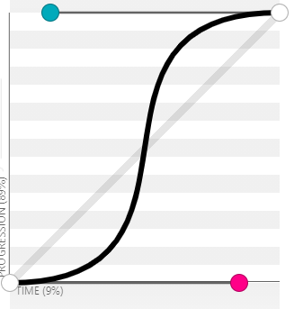

# Day 36

These were the last lessons on FCC's Applied Visual Design.

## Bezier Curve (cubic-bezier() function)

### Definition

The bezier curve is used on css, through the cubic-bezier() function as a value to the `animation-timing-function` CSS property, to fine-tune the amount of an animation that happens during specific intervals between keyframes.

It can be used to accelerate or deccelerate parts of an animation at any point in the time during the animation's duration.

### In-depth Explanation

Bezier curve is based on a 4 position, 1 by 1 coordinate system (values between 0 and 1). The positions are called **p0, p1, p2 and p3**. In CSS, `p0` and `p3` are predefined to be located at (0, 0) and (1, 1), respectively, which means `p0` is at the origin of the curve and `p3` is at the end (imagine a line segment "p0p1p2p3"). So, we're left with `p1` and `p2`, which are defined inside the `cubic-bezier()` function and serve as **anchor points** to create curves in this line segment.

The first two values passed to the function are the x and y coordinates of `p1`; the two last values are the x and y coordinates of `p2`. **Note that x refers to the horizontal axis and y refers to the vertical axis.**

Where you put `p1` in the bezier curve will be the anchor point, to which the curve will be pulled to. Same for `p2`. E.g.:



In this case, p1 is set to `(0.2, 0.7)`. So that is where the p1 anchor point is set, so the line curves towards that point. The same happens with p2, located at `(0.8, 0.2)`. The function is given by `cubic-bezier(0.2, 0.7, 0.8, 0.2)`

With this in mind, you can modify the curve to adjust **how much animation should progress in a given period of time, relative to its duration.**

You can look at the horizontal axis (x; time) in percentages -- 0.5 = 50%; 1 = 100% etc. This is a percentage of the animation duration, or, more precisely, the keyframe. E.g.: the x value of 1, represents the last keyframe of the animation.

The vertical axis refers to how much of the animation effect should happen. For instance: In an animation which consists of moving an object from `left: 0px` to `left: 200px`, the y value of 1 represents the `left: 200px`, while 0.5 would represent `left: 100px`.

Now, let's say the duration of the animation above is 4 seconds long. The element will go from `left: 0px` to `left: 200px` in 4 seconds. However, say we want it to start very slow, speed up in the middle and then end very slowly. This is similar to the ease-in-out predefined values, but we want to accentuate the speed differences.

To be more specific, I want the element to move around 100px (very fast) between the 2s and 3s marks.

In this case, I would have to give `p1` and `p2` values that would curve the bezier line in such a way to make the animation progress how I want it.

The curve should go through the 1s mark and 50px, then at the 2s mark, go from 0px to 150px at the 3s mark. Finally, at the 4s mark, it should reach the last keyframe -- 200px.

How do I define the p1 and p2 values to achieve this bezier curve? Like so:

```html
<!DOCTYPE html>
<head>
    <style>
        * {
            box-sizing: border-box;
        }
        body {
            padding: 0;
            margin: 0;
        }
        .ball {
            background-color: royalblue;
            width: 50px;
            height: 50px;
            margin: 10px;
            border-radius: 50%;
            position: absolute;
            top: 0px;
            left: 0px;
            animation: to-the-right 4s cubic-bezier(0.85, 0, 0.15, 1) infinite
        }

        @keyframes to-the-right {
            0% {
                left: 0px;
            }

            100% {
                left: 200px;
            }
        }
    </style>
</head>

<body>
    <div class="ball"></div>
</body>
```

It's somewhat close to what we I want. It doesn't have to be pixel perfect, but even if it had, with patience, you can find the right `p1` and `p2` values for the job.

Here is the visual representation of the above bezier curve:


*Courtesy of cubic-bezier.com*

By the way, this website (cubic-bezier) is amazing to visualize `cubic-bezier()` values. It makes learning this whole concept much easier.
